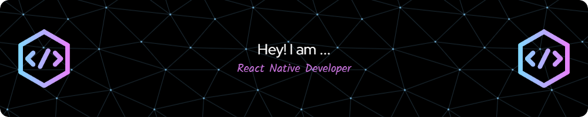

# 👋 Hi, I'm Yogesh Solanki  

💡 **Senior React Native Developer** with 4+ years of expertise in **mobile and web development**.  
I specialize in **Native & Turbo Modules (Kotlin & Objective-C)**, **React.js**, **Django**, and **Node.js**.  
Passionate about **building high-performance cross-platform apps**, contributing to **open-source**, and exploring **cutting-edge UI/UX solutions**.  

---

  
  
  
  
  

---

## 🚀 Technical Stack  

### 📱 Mobile Development  

### 💻 Frontend  

### ⚙️ State Management & Testing  

### 🌐 Backend & Cloud  

---

## 🏆 Achievements  
- 🌟 **Employee of the Year (2023)**  
- 🎯 **Employee of the Quarter (Q4 2024)**  
- 🛠️ **Contributed to popular open-source packages**: React Native Sound, Voice, SplashScreen  
- 🚀 **Built & launched 10+ cross-platform apps** successfully in production  

---

## 📱 Featured Projects  

### 🔹 [SkiaAnimations](https://github.com/SolankiYogesh/SkiaAnimations)  
🎨 React Native Skia Examples & UI challenges  

### 🔹 [Reeva AI](#) *(Private Project)*  
📄 AI-powered contract drafting app focused on UK legal documents  

### 🔹 [Klizpy](#) *(Private Project)*  
🎬 Short-video entertainment platform with live features  

---

## 📊 GitHub Stats  

  
    
    

  

  
    

  

---

## 🌐 Connect With Me  

📌 Portfolio: [SolankiYogesh.io](https://yogeshsolanki.vercel.app)  
📧 Email: solankiyogesh3500@gmail.com  

---

  
    

