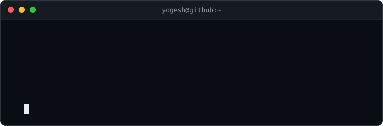

<div align="center">



<br/>

[](https://yogesh.ciertolab.in)
[](https://www.linkedin.com/in/solanki-yogesh-06104a209/)
[](mailto:solankiyogesh3500@gmail.com)
[](https://www.instagram.com/ll__yogesh_6098_ll)

</div>

<br/>

### `$ cat ~/focus.json`

```jsonc
{
  "role": "Senior React Native Developer",
  "location": "Gujarat, India",
  "experience": "5+ years",
  "building": "Nitro Modules for React Native",
  "shipping": ["Kotlin/Android", "Swift/iOS & macOS"],
  "exploring": ["Go", "AI-powered apps"],
  "status": "open_to_opportunities" // 🚀
}
```

<br/>

### `$ skills --list --theme=dark`

<div align="center">


</div>

<br/>

### `$ npm search @solankiyogesh --sort=stars`

```
⭐ 12   react-native-nitro-share-intent      receive shared text/images/files via Nitro Modules
⭐  7   react-native-nitro-image-colors      extract prominent colors from an image
⭐  6   react-native-nitro-media-metadata    read metadata from any image, video or audio
⭐  6   rn-date-format                       device 12h/24h time format, natively
⭐  2   remote-logger                        real-time logging + a live Next.js dashboard
⭐  1   react-native-real-path               resolve real paths from content:// URIs
   —    rn-camera-roll-fetcher-ios           iOS ph:// asset URIs → usable file:// paths
```

<sub>→ install any of these with `npm i <package-name>`, all links on <a href="https://www.npmjs.com/~solankiyogesh">npmjs.com/~solankiyogesh</a></sub>

<br/>

### `$ ls -la ~/shipped --starred`

| | project | what it does | →|
|:---:|---|---|:---:|
| 📱 | **Klipzy** | Short-video app — emoji reactions drive a real-time creator leaderboard | [Play Store](https://play.google.com/store/apps/details?id=com.klipzy&hl=en) |
| 🌾 | **Gam Ni Vato** | Farmer marketplace — sell produce, check prices, find nearby dealers | [Play Store](https://play.google.com/store/apps/details?id=com.gamnivato&hl=en) |
| 🔧 | **Handy Man** | Find & register as a handyman — plumbers, electricians, mechanics | [Play Store](https://play.google.com/store/apps/details?id=com.sy.handyman&hl=en_IN) |
| 🥗 | **inGredients AI** | Scan a product's ingredients, find out if it's actually healthy | [GitHub](https://github.com/SolankiYogesh/inGredientsAi-RN) |
| 🎓 | **AI Interview Platform** | Practice technical & IELTS speaking interviews against an AI | [GitHub](https://github.com/SolankiYogesh/ai-interview-platform) |
| 🌐 | **Portfolio** | React + GSAP + tsParticles — cinematic loader, custom cursor | [Live](https://yogesh.ciertolab.in) |

<br/>

### `$ cat ~/stats.log`

<div align="center">


</div>

<br/>

### `$ echo "thanks for stopping by" && exit 0`

<div align="center">

Open to full-time roles, freelance work & open-source collaboration.
<sub>⭐ star this repo if any of it was useful to you.</sub>

</div>
